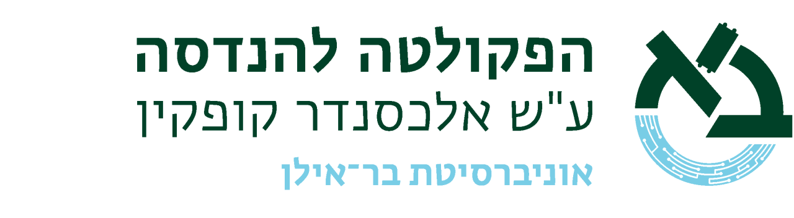
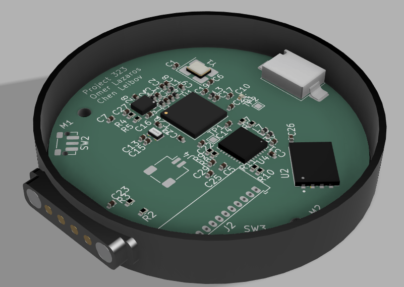
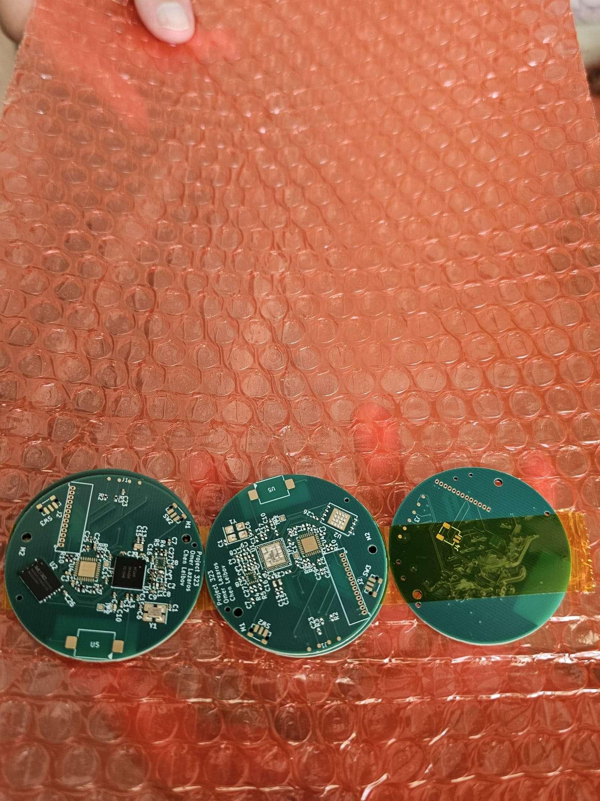
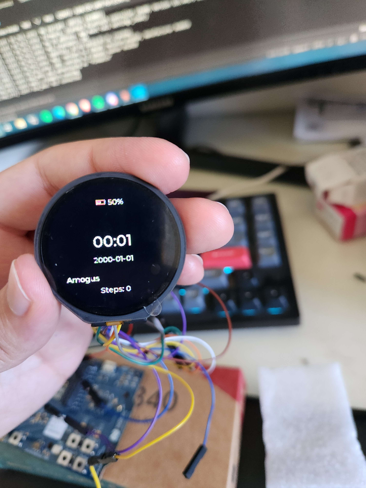

<p align="center">
  
</p>

<h1 align="center">FinWatch</h1>

<p align="center">
  An open-source, Zephyr-powered BLE smartwatch with a modular I²C expansion port.<br>
  Final project in Computer Engineering, Bar-Ilan University (Project 323).
</p>

<p align="center">
  
</p>

## About

FinWatch is a complete custom smartwatch: the PCB (KiCad), the firmware (Zephyr RTOS / nRF Connect SDK) and a documented protocol for attaching new hardware to it.

Most smartwatches, commercial and open-source, are sealed. The sensors are fixed at manufacture, so a new measurement means a new watch. FinWatch asks whether a finished watch can be extended instead. A four-pin pogo connector on the back of the case carries 3.3 V, GND and an I²C bus. A module clipped onto it describes itself to the watch at runtime, and the firmware does not need to know about that module in advance.

The protocol that makes this work is the **FinWatch Module Protocol (FWMP)**. It is a self-describing, CRC-protected descriptor format. The host treats every byte from a module as untrusted and validates it before use.

The full write-up (design, protocol specification, verification, lessons learned) is in [report/main.pdf](report/main.pdf).

## Features

### Hardware

- **Nordic nRF5340** dual-core SoC (Cortex-M33 application core plus a separate network core running the BLE controller)
- **Nordic nPM1300** PMIC: Li-Po charging, fuel gauge, regulated 1.8 V and 3.3 V rails
- **GC9A01** 240×240 round LCD (SPI) with **CST816S** capacitive touch (I²C)
- **Bosch BMI270** 6-axis IMU with an any-motion interrupt, so the MCU sleeps until the wrist moves
- **Macronix MX25U51245G** 512 Mbit SPI NOR flash for assets and settings
- 32.768 kHz crystal for the RTC
- Two user buttons
- **4-pin pogo expansion port** (3.3 V, GND, SDA, SCL), level-shifted from the SoC's 1.8 V domain by a PCA9306
- 4-layer, 46 mm round PCB designed in KiCad (see [kicad/](kicad/))

### Software

- Zephyr RTOS on the nRF Connect SDK (NCS v3.2.1), with the application running in TF-M non-secure
- LVGL user interface: watch face showing time, date, battery and steps, plus a screen for the attached module
- Interrupt-driven step counting. The IMU wakes the host and the host only samples while the wrist is moving
- BLE with battery level notifications
- LittleFS on the external flash for persistent settings
- **FWMP host**: hot-plug detection, descriptor validation, input and output reports, adaptive polling, and I²C bus recovery
- Expansion runs at the lowest thread priority, so a misbehaving module cannot stall the display, sensors or radio link
- Hardware is described in the Devicetree only, so the same firmware runs on the nRF5340-DK and the custom PCB

## Expansion port and FWMP

FWMP is specified in three layers:

| Layer | What it defines |
| --- | --- |
| Electrical | Four contacts, 3.3 V supply, no pull-ups on the module side, level shifting on the watch |
| Logical | Register map and a TLV descriptor (identity, capabilities, report sizes, preferred poll rate) protected by a CRC-16 |
| Behavioural | Presence detection, enumeration, polling state machine, and recovery from faults |

The host rejects bad magic, bad protocol version, bad CRC, oversized lengths and TLV overruns. It also recovers a jammed bus. All of these paths were exercised with injected faults against a mock module. See section 4 of the report for the full specification and for how to write a compliant module.

## Hardware

<p align="center">
  
</p>

| Path | Contents |
| --- | --- |
| [kicad/](kicad/) | Schematic, PCB layout, custom symbols, footprints and 3D models |
| [kicad/watch_thing_alt.pdf](kicad/watch_thing_alt.pdf) | Schematic PDF |
| [kicad/components/board1_nrf5340/](kicad/components/board1_nrf5340/) | Gerber and drill files |

**Revision status**

- **Revision A** was manufactured and assembled. The power rails came up correctly, but `SWDIO` and `SWDCLK` were never routed, so the board could not be programmed.
- **Revision B** exposes SWD on test pads: `SWDIO` on TP4, `SWDCLK` on TP3, `nRESET` on TP2. The lesson from this defect became a pre-fabrication checklist, documented in the report.

## Firmware

<p align="center">
  
</p>

Above: the firmware running on the nRF5340-DK with the round display wired up.

```
code/
├── prj.conf                  Kconfig
├── boards/                   Devicetree overlays
├── child_image/hci_ipc.conf  Network-core BLE controller config
└── src/
    ├── main.c
    ├── ble/        BLE and battery notifications
    ├── buttons/    short and long press handling
    ├── display/    LVGL, watch face, module screen
    ├── expansion/  FWMP host, transport and mock module
    ├── pmic/       nPM1300: charger and fuel gauge
    ├── rtc/        timekeeping on the 32.768 kHz crystal
    ├── sensor/     BMI270 any-motion and step counting
    ├── storage/    external flash and LittleFS
    └── touch/      CST816S
```

### Building
```
IMPORTANT: the board itself does not include a bootloader to flash the firmware, in our case we used the one in the nRF5340DK.
```
1. Install the [nRF Connect SDK](https://docs.nordicsemi.com/bundle/ncs-latest/page/nrf/installation.html) **v3.2.1** and open an NCS shell.
2. Build and flash:

```sh
cd code
west build -b nrf5340dk/nrf5340/cpuapp/ns
west flash
```

To test the expansion protocol without any module hardware, enable the mock backend, which simulates a "Test Dial" module:

```sh
west build -b nrf5340dk/nrf5340/cpuapp/ns -- -DCONFIG_FINWATCH_EXPANSION_MOCK=y
```

> For the custom PCB, rename [code/boards/your_board.overlay](code/boards/your_board.overlay) to match your board target and confirm every pin marked `/* [PCB] */` against the schematic before flashing.

## Verification

- Firmware verified on the nRF5340-DK: display, touch, IMU, buttons and BLE
- FWMP verified against a mock module, including hot-plug and six injected-fault classes
- Revision A power rails verified; Revision B bring-up: *TODO*

Full results and their limits are in the report.

## Repository layout

| Folder | Contents |
| --- | --- |
| [code/](code/) | Zephyr firmware |
| [kicad/](kicad/) | PCB design files |
| [report/](report/) | Final project report (LaTeX and PDF) and presentation |
| [pics/](pics/) | Photos and renders |

## Authors

- **Omer Lazaros**
- **Chen Leibov**

Supervised by Prof. Leonid Yavitz. Project mentor: David Freud. Faculty of Engineering, Bar-Ilan University.

## Thanks

Thanks to the Zephyr Project, Nordic Semiconductor (nRF Connect SDK and its courses) and KiCad, whose open tools and documentation made this possible. [ZSWatch](https://github.com/ZSWatch/ZSWatch) was a major inspiration for this project.

## License

*TODO: pick a license (for example GPL-3.0 or MIT for the firmware and CERN-OHL for the hardware) and add a LICENSE file.*
